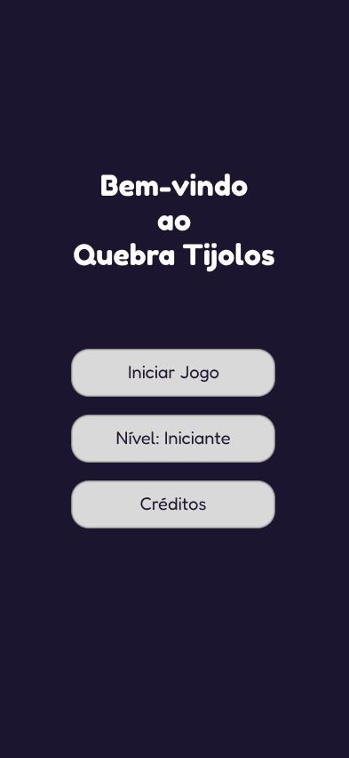
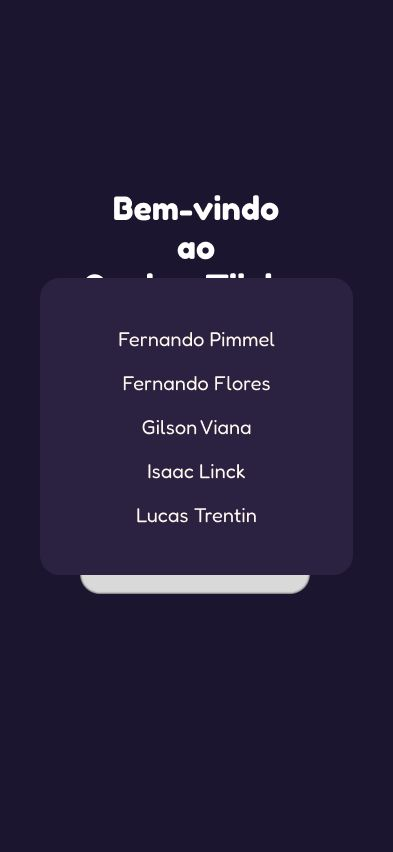
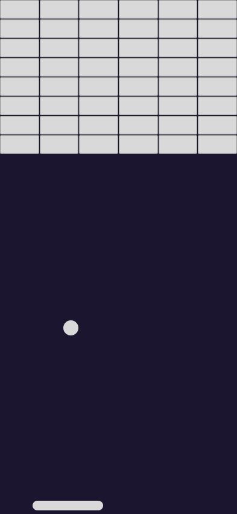
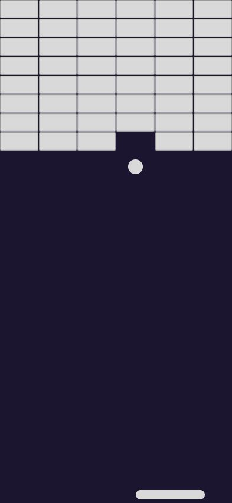
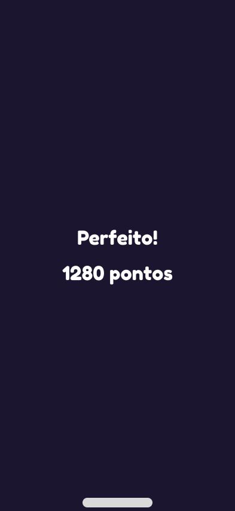
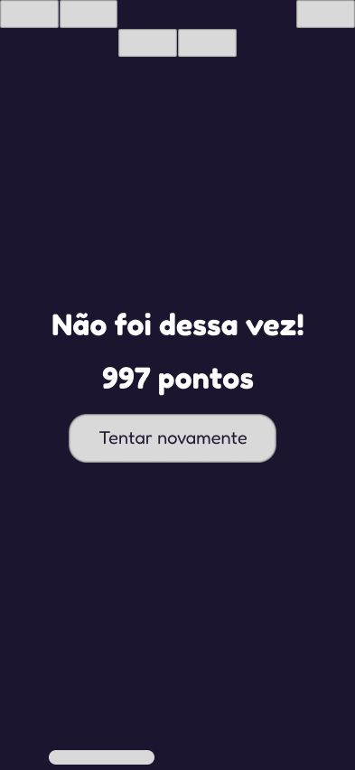

# Wireframes

Wireframes das telas do jogo Quebra Tijolo, localizados em [assets/wireframes/](../assets/wireframes/).

## 01. Bem-vindo

Tela inicial do jogo, exibindo o título "Quebra Tijolos" e três opções: iniciar o jogo, alternar o nível de dificuldade e visualizar os créditos.

## 02. Créditos

Modal sobreposto à tela inicial, listando os integrantes do grupo responsáveis pelo desenvolvimento do projeto.

## 03. Início (jogo)

Estado inicial da partida: a grade de tijolos completa no topo, a bola centralizada e a plataforma (paddle) na base da tela.

## 04. Jogando

Partida em andamento, com tijolos já destruídos na grade e a bola em movimento.

## 05. Ganhou

Tela exibida ao destruir todos os tijolos, mostrando a mensagem "Perfeito!" e a pontuação final.

## 06. Perdeu

Tela exibida ao perder a bola, mostrando a mensagem "Não foi dessa vez!", a pontuação obtida e o botão para tentar novamente.
